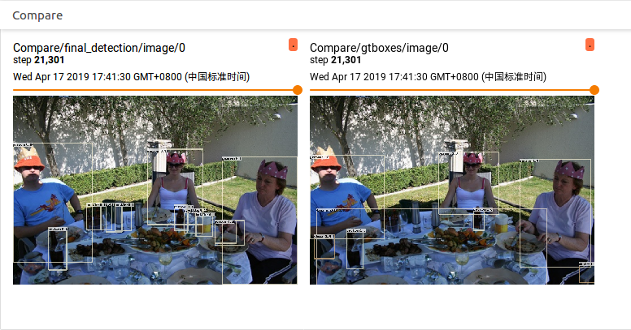

# FCOS: Fully Convolutional One-Stage Object Detection     

## Abstract
This is a tensorflow re-implementation of [FCOS: Fully Convolutional One-Stage Object Detection](https://arxiv.org/abs/1904.01355), and completed by [YangXue](https://yangxue0827.github.io/).     

### Performance
| Model |    Backbone    |    Training data    |    Val data    |    mAP    | Inf time (fps) | Model Link | Train Schedule | GPU | Image/GPU | Configuration File |
|:------------:|:------------:|:------------:|:---------:|:-----------:|:----------:|:----------:|:----------:|:----------:|:-----------:|:-----------:|
| [Faster-RCNN](https://github.com/DetectionTeamUCAS/Faster-RCNN_Tensorflow) | ResNet50_v1 600 | VOC07 trainval | VOC07 test | 73.09 | - | - | - | 1X GTX 1080Ti | 1 | - |
| [FPN](https://github.com/DetectionTeamUCAS/FPN_Tensorflow) | ResNet50_v1 600 | VOC07 trainval | VOC07 test | 74.26 | - | - | - | 1X GTX 1080Ti | 1 | - |
| [RetinaNet](https://github.com/DetectionTeamUCAS/RetinaNet_Tensorflow) | ResNet50_v1d 600 | VOC07 trainval | VOC07 test | 74.00 | 14.6 | [model](https://drive.google.com/file/d/1qjYsAi5uHB-6KgnrgWTN42a7Njkah-rA/view?usp=sharing) | - | 4X GeForce RTX 2080 Ti | 2 | - |
| FCOS | ResNet50_v1d 896 | VOC07 trainval | VOC07 test | 72.25 | 14.3 | [Baidu Drive (ujvj)](https://pan.baidu.com/s/1suZbHLvkDqAWh0qtOSTesQ) | - | 3X GeForce RTX 2080 Ti | 2 | [cfgs_fcos_voc07_res50_v4.py](./libs/configs/VOC2007/cfgs_fcos_voc07_res50_v4.py) |
| [RetinaNet](https://github.com/DetectionTeamUCAS/RetinaNet_Tensorflow) | ResNet50_v1d 600 | COCO train2017 | COCO val2017 (coco minival) | 34.3 (paper: 34.0) | 12.2 | [model](https://drive.google.com/file/d/1UIHFh_QnYpQCeFPimnmZhPuxpIkFjwq5/view?usp=sharing) | 1x | 4X GeForce RTX 2080 Ti | 2 | - |
| FCOS | ResNet50_v1d 600 | COCO train2017 | COCO val2017 (coco minival) | 34.8 | 12.2 | [Baidu Drive (qg62)](https://pan.baidu.com/s/1RCwbeh_jAbxi2shso41y3g) | 1x | 3X GeForce RTX 2080 Ti | 2 | [cfgs_fcos_coco_res50_1x_v1.py](./libs/configs/COCO/cfgs_fcos_coco_res50_1x_v1.py) |

## My Development Environment
1、python3.5 (anaconda recommend)             
2、cuda10.0                     
3、[opencv(cv2)](https://pypi.org/project/opencv-python/)    
4、[tfplot](https://github.com/wookayin/tensorflow-plot) (optional)            
5、tensorflow >= 1.12                     

## Download Model
### Pretrain weights
1、Please download [resnet50_v1](http://download.tensorflow.org/models/resnet_v1_50_2016_08_28.tar.gz), [resnet101_v1](http://download.tensorflow.org/models/resnet_v1_101_2016_08_28.tar.gz) pre-trained models on Imagenet, put it to data/pretrained_weights.       
2、**(Recommend in this repo)** Or you can choose to use a better backbone, refer to [gluon2TF](https://github.com/yangJirui/gluon2TF).    
* [Baidu Drive](https://pan.baidu.com/s/1GpqKg0dOaaWmwshvv1qWGg), password: 5ht9.          
* [Google Drive](https://drive.google.com/drive/folders/1BM8ffn1WnsRRb5RcuAcyJAHX8NS2M1Gz?usp=sharing) 

### Others
1、COCO dataset related      
* [instances_minival2014.json](https://drive.google.com/file/d/1cgyEzdGVfx7zPNUO0lLfm8pu0HfIj3Xv/view?usp=sharing)
* [coco_minival2014.odgt](https://drive.google.com/file/d/1Au55e6lqvuTunNBZO2Cj4Kh9XySyM3ZN/view?usp=sharing)       
* [coco_trainvalmini.odgt](https://drive.google.com/file/d/1TSbPjY7HNDryIL3PB6pkO2EVDAwsyD3k/view?usp=sharing)  

## Compile
```  
cd $PATH_ROOT/libs/box_utils/cython_utils
python setup.py build_ext --inplace

cd $PATH_ROOT/libs/box_utils/nms
python setup.py build_ext --inplace
```

## Train

1、If you want to train your own data, please note:  
```     
(1) Modify parameters (such as CLASS_NUM, DATASET_NAME, VERSION, etc.) in $PATH_ROOT/libs/configs/cfgs.py
(2) Add category information in $PATH_ROOT/libs/label_name_dict/lable_dict.py     
(3) Add data_name to $PATH_ROOT/data/io/read_tfrecord.py 
```     

2、Make tfrecord
```  
cd $PATH_ROOT/data/io/  
python convert_data_to_tfrecord_coco.py --VOC_dir='/PATH/TO/JSON/FILE/' 
                                        --save_name='train' 
                                        --dataset='coco'
```      

3、Multi-gpu train
```  
cd $PATH_ROOT/tools
multi_gpu_train.py
```

## Eval
### COCO
```  
cd $PATH_ROOT/tools
python eval_coco.py --eval_data='/PATH/TO/IMAGES/'  
                    --eval_gt='/PATH/TO/TEST/ANNOTATION/'
                    --gpus='0,1,2,3,4,5,6,7'           
``` 

### PASCAL VOC
```  
cd $PATH_ROOT/tools
python eval.py --eval_dir='/PATH/TO/IMAGES/'  
               --annotation_dir='/PATH/TO/TEST/ANNOTATION/'
               --gpu='0'
                    
```

## Tensorboard
```  
cd $PATH_ROOT/output/summary
tensorboard --logdir=.
``` 




## Reference
1、https://github.com/endernewton/tf-faster-rcnn   
2、https://github.com/zengarden/light_head_rcnn   
3、https://github.com/tensorflow/models/tree/master/research/object_detection        
4、https://github.com/CharlesShang/FastMaskRCNN       
5、https://github.com/matterport/Mask_RCNN      
6、https://github.com/msracver/Deformable-ConvNets      
7、https://github.com/tianzhi0549/FCOS       
